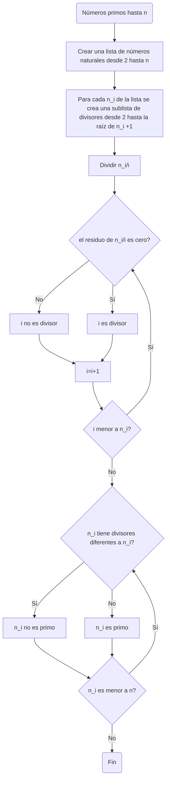

# Algoritmos y pseudocódigos
## Ejemplos matemáticos presentados en diagramas de flujo y pseudocódigos

### Determinación de números primos hasta n
#### Diagrama de flujo (secuencia del algoritmo)

#### Pseudocódigo

```pseudocode
[variables]
n : entero
i : entero
n_i : entero

inicio
i:=2
 mientras (i<n) hacer
  si modulo (n.i) == 0
   escribir ('i es divisor de n_i')
  si no
   escribir ('i no es divisor de n_i')
 Fin mientras
 
crear lista para  cada n_i []
para cada i que cumple la condición de ser divisor ()
agregar a la lista (i)

 mientras (n_i< n) hacer
  si lista n_i contiene más de un elemento
   escribir ('n_i no es un número primo')
  si no
   escribir ('n_i es un número primo')
 Fin mientras
Fin 
```


	
