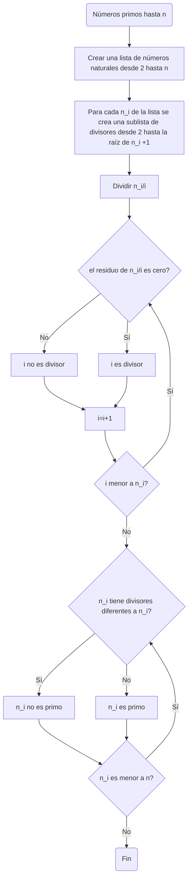
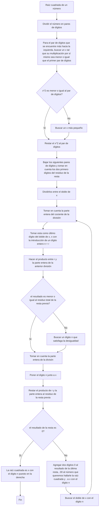

# Algoritmos y pseudocódigos
## Procedimientos matemáticos presentados en diagramas de flujo y pseudocódigos

### Determinación de números primos hasta n
#### Diagrama de flujo (secuencia del algoritmo)

#### Pseudocódigo

```pseudocode
[variables]
n : entero
i : entero
n_i : entero

inicio
i:=2
 mientras (i<n) hacer
  si modulo (n.i) == 0
   escribir ('i es divisor de n_i')
  si no
   escribir ('i no es divisor de n_i')
 Fin mientras
 
crear lista para  cada n_i []
para cada i que cumple la condición de ser divisor ()
agregar a la lista (i)

 mientras (n_i< n) hacer
  si lista n_i contiene más de un elemento
   escribir ('n_i no es un número primo')
  si no
   escribir ('n_i es un número primo')
 Fin mientras
Fin 
```
### Hallar raíz cuadrada de un número

#### Pseudocódigo

```pseudocode
[variables]
x : entero
n : entero
r : entero
y : real
t : entero

inicio
crear lista de pares de dígitos.i []
crear lista de 0 a 9.x []
para cada i:
 mientras (i<= x^2) hacer
  i-x^2
 si no
   probar con un x menor de la lista
 Fin mientras
Tomar los dos primeros dígitos de la resta = s	
y = s/2*x
Tomar los dígitos enteros de y y ponerlos en la parte derecha de x = r
r*parte entera de y = t
 mientras (t<=(i-x^2)) hacer
  Tomar la parte entera de y 
 sino
    Buscar un n tal que cumpla la desigualdad
 Fin mientras
Poner el dígito n junto a x = a
(i-x^2)-t
 mientras (i-x^2)-t = 0 hacer
   raizcuadrada del numero = a
 sino
   resultado de (i-x^2)-t agregarle dos cifras decimales (00), .00 al número que queremos hallarle la raíz cuadrada y . a a
 Fin mientras
Fin 


